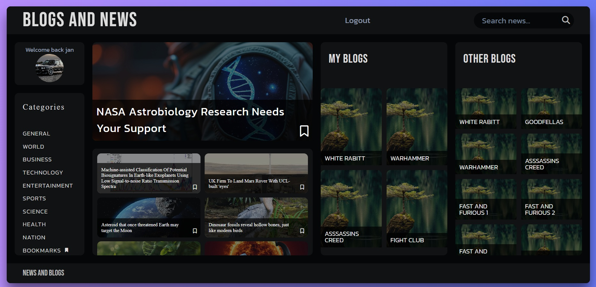
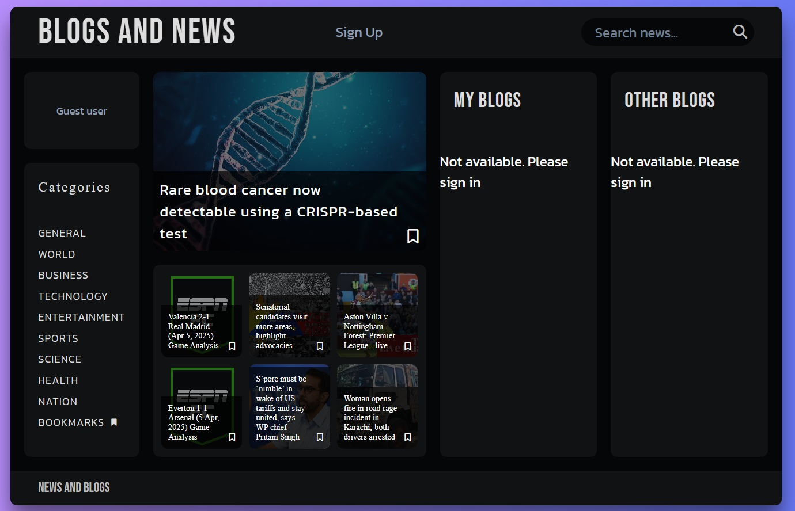
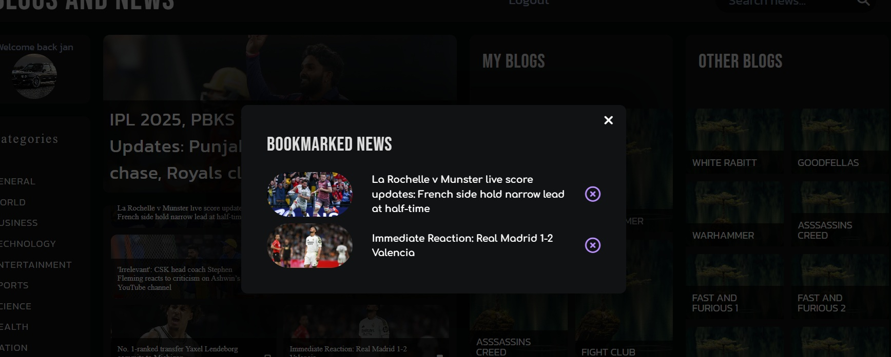
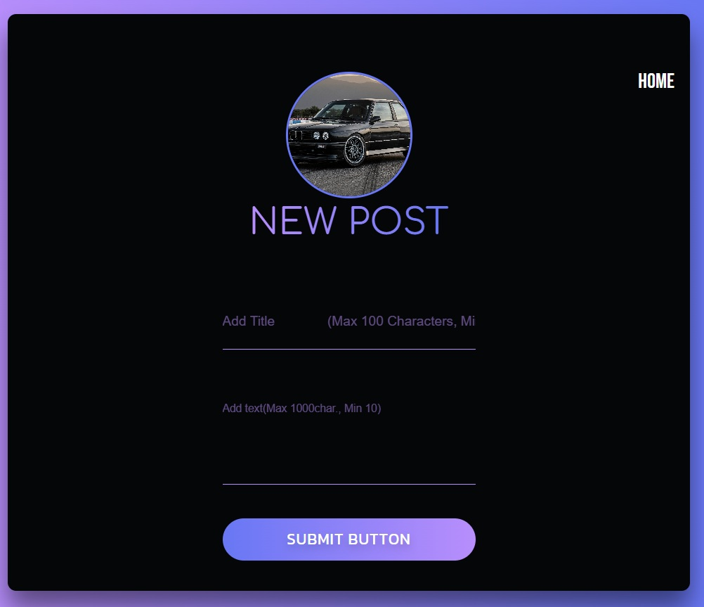
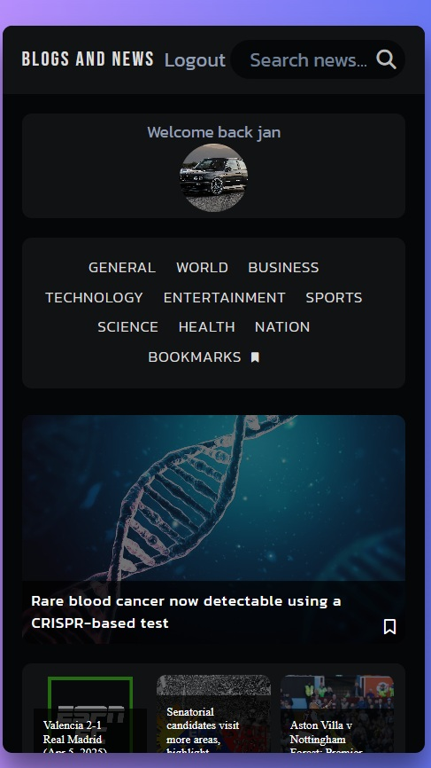

# Blog APP

This is a full stack application (MERN) with authentication functionalities (register and login/logout), saving user's data and blog posts into MongoDB database and using GNews API's (https://gnews.io/) for searching and browsing the worldwide news. With it's free account we are eligable for up to 100 API requests per day. This app also aplies responsive design principles so that it can be used on multiple devices. We have to create an account for both the MongoDB and GNews. For testing our API endpoints we have used a tool called Postman. For the back-end we used the same logic as in our's Nodejs-MongoDB-Security-features- project with some modifications. 

------

This is our main page, where we can browse for news, login into our application and read our's and other peoples blog posts. We don't see the blog posts part of the page unless we are loged in. We have to first register into our database. Once we are loged in we can create and delete posts, but only our posts.

While clicking on posts or news articles modals pop up for closer inspection and we can follow news articles to their actual website. We can save bookmarked news in our bookmarks category state.

